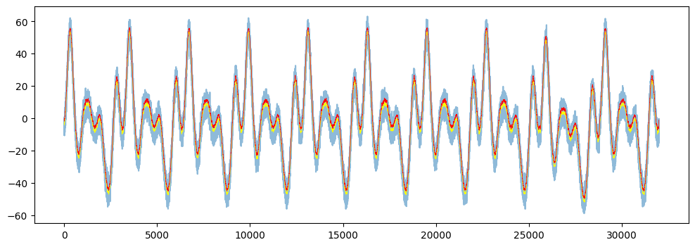
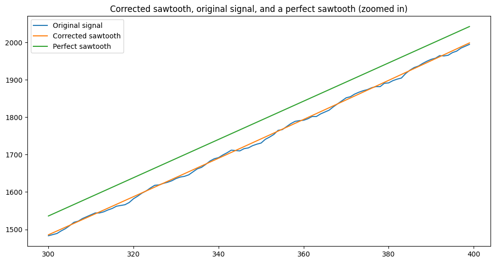
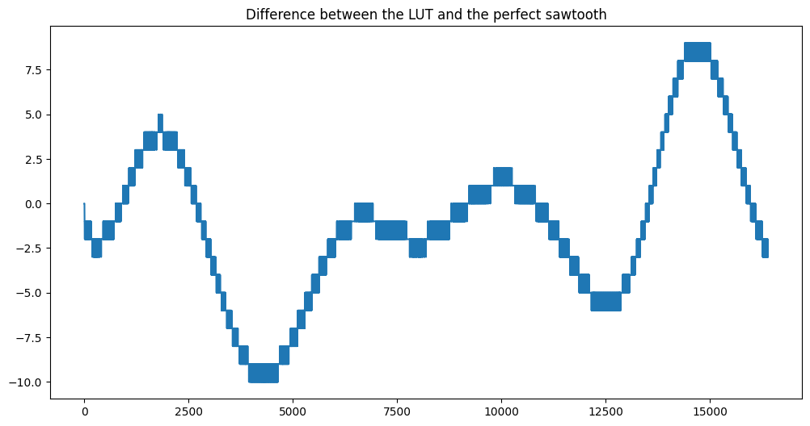

# Motor Position Correction

## Problem
As part of my research work at the [CBA lab](https://cba.mit.edu/), I assisted [Jake Read](https://jakeread.pages.cba.mit.edu/) in his work to develop better fabrication machines.

We wanted to achieve absolute positioning of stepper motors so we used an encoder that measures the motor position at any given time. The position values are integers from `0-16383` that represent the angle of which the motor is facing.

Unfortunately, the encoder and the motor shaft are slightly misaligned, resulting in deviated readings of the encoder. This misalignment causes non-linear position readings and inconsistent motion.

## Overview
The algorithm fits a function using Fourier analysis on the deviation of the encoder readings from the expected sawtooth pattern and uses this function to build a lookup table that is later used by the motor firmware.

The algorithm was tested on a real system and produced a smooth and consistent motion. The improvement was significant enough to be audible - the 'wobbly' motion without the algorithm was replaced by clean, precise movement.

## Implementation
As seen below, the encoder readings deviate from the expected sawtooth pattern of a smooth consistent motor rotation.

First, we smooth the data using a simpler moving average filter and remove the DC offset to center the data around zero.

We then analyze the most prominent frequencies in the data using Fourier analysis to fit a function to the deviation signal.

The resulting function fits the deviation signal almost perfectly, as seen below.

And with all periods stacked over each other.

We can now use this function to correct the encoder readings to the expected sawtooth pattern.

And finally we build a lookup table that is later used by the motor firmware that maps the encoder readings to the correct motor position.

